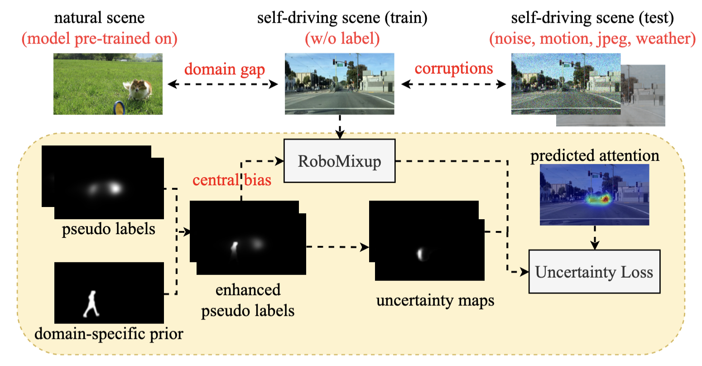
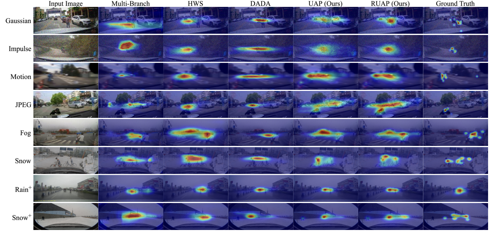

<div align="center">

<h1>Towards Robust Unsupervised Attention Prediction in Autonomous Driving</h1>


<br />

[](https://arxiv.org/abs/2501.15045)
[](https://github.com/zaplm/DriverAttention#dataset-preparation)
[](LICENSE)
[](https://github.com/zaplm/DriverAttention/tree/iccv)

<div>
    <a href="https://jueduilingdu.github.io/" target="_blank">Mengshi Qi</a><sup>1*</sup>, 
    Xiaoyang Bi<sup>1</sup>, 
    Xianlin Zhang<sup>1</sup>, 
    <a href="https://scholar.google.com/citations?user=A-vcjvUAAAAJ&hl=zh-CN" target="_blank">Huadong Ma</a><sup>1</sup>
</div>

<div>
    <sup>1</sup>Beijing University of Posts and Telecommunications
</div>

<p align="justify">
    <i>This repository is an extension of our ICCV conference paper, <b>"Unsupervised Self-Driving Attention Prediction via Uncertainty Mining and Knowledge Embedding."</b> We propose a robust unsupervised framework that eliminates the need for expensive traffic labels. By leveraging an <b>Uncertainty Mining Branch</b> and a <b>Domain-Specific Prior Enhancement Block</b>, our method bridges the gap between natural and driving scenes. Furthermore, we introduce <b>RoboMixup</b> and the <b>DriverAttention-C</b> benchmark to address the challenges of corruption and central bias in real-world autonomous driving.</i>
</p>

</div>

---

## 📢 Release
- `2025-12-24` 🚀 We released **DriverAttention-C**, a comprehensive benchmark with **126k+ frames** for robustness evaluation.
- `2025-01-15` 📝 Our extended work is available on [arXiv](https://arxiv.org/abs/2501.15045).
- `2023-08-07` 🎉 Original work accepted by **ICCV 2023**! Check the `iccv` branch for the conference code.

---

## 📊 DriverAttention-C Benchmark

To systematically evaluate robustness, we introduce **DriverAttention-C**, comprising over **126k** frames across synthetic and real-world scenarios. It features **49k+** manually re-annotated frames to ensure ground truth validity under adverse conditions.

| Data Type | Subset | Images | Corruption Categories | Manual Annotations |
| :--- | :--- | :--- | :--- | :--- |
| **Synthetic** | BDD-A-C, DR(eye)VE-C, DADA-C | 115,332  | Noise, Blur, Digital, Weather | 38,444 |
| **Real-world**| DriverAttention-Snow-C | 10,743 | Authentic Snowy Scenes | 10,743 |


### Dataset Preparation
The datasets and ground truth labels can be downloaded via:
- **Synthetic subsets:** [Images/Camera Effects](https://drive.google.com/file/d/1p9rmy3dXESSaHiGHApxcy-aQlAymDzz7/view?usp=sharing) | [Adverse Weather](https://drive.google.com/file/d/1pYCBxmjjJ-4yn4IsueUBlCva7jVfJIJR/view?usp=drive_link)
- **Real-world (Snow):** [Images](https://drive.google.com/file/d/1pDkzthIsLevGuEKBXmuXvW-5HowGRp4s/view?usp=drive_link) | [Ground Truth](https://drive.google.com/file/d/1lbP-1yWTc1Qn9Vty3ybFxFVoSbTxdbJg/view?usp=drive_link)

---


## 📈 Results

Extensive experiments demonstrate that our unsupervised method matches or surpasses state-of-the-art fully supervised approaches, reducing **corruption degradation by 7.2%** and mitigating **central bias by 11.2%** in terms of KLD.



---


## 🛠️ Run


### Training (Robustness & Central Bias)

```bash
# Corruption Robustness Training 
python train_robo_cor.py --name exp_name --data-path path/to/data --topK 8 --mix_dir temp_dir

# Mitigating Central Bias Training
python train_longtail.py --name rcpreg --data-path path/to/data --batch-size 4
```

### Evaluation
```bash
# Calculate KLD and CC
python test_cor.py --data-path path/to/data --save_model model_name
```
*Note: For SIM, AUC-Borji, AUC-Judd, NSS, please follow the implementation provided in [SaliencyMamba metrics](https://github.com/zhao-chunyu/SaliencyMamba/tree/main/metrics).*


## 💡 Decision-Making Application

We demonstrate the importance of attention prediction in autonomous driving decision-making. 
1. Prepare data following [BDD-OIA](https://github.com/Twizwei/bddoia_project).
2. Train the decision model utilizing attention ROIs:

```bash
python train_decision.py --name test_ --atten_model {infer_dir} --data-path path/to/data
```

## 🙏 Acknowledgement

We would like to thank the authors of **SaliencyMamba** for their contribution to the community. Part of evaluation metrics code is integrated from [SaliencyMamba metrics](https://github.com/zhao-chunyu/SaliencyMamba/tree/main/metrics).

## Citation

```bibtex
@article{qi2025towards,
  title={Towards Robust Unsupervised Attention Prediction in Autonomous Driving},
  author={Qi, Mengshi and Bi, Xiaoyang and Ma, Huadong},
  journal={arXiv preprint arXiv:2501.15045},
  year={2025}
}


@inproceedings{zhu2023unsupervised,
  title={Unsupervised self-driving attention prediction via uncertainty mining and knowledge embedding},
  author={Zhu, Pengfei and Qi, Mengshi and Li, Xia and Li, Weijian and Ma, Huadong},
  booktitle={Proceedings of the IEEE/CVF International Conference on Computer Vision},
  pages={8558--8568},
  year={2023}
}

```
